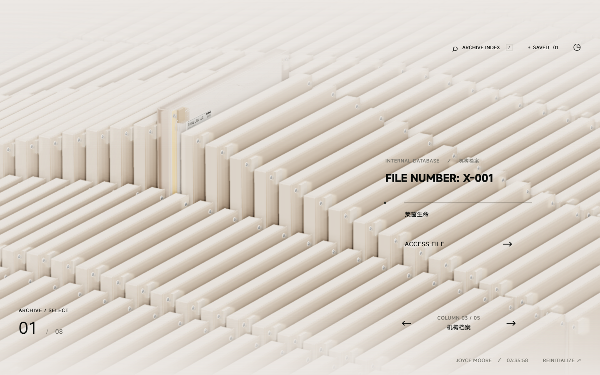

# RhineUI

以三维档案阵列为入口的知识站点模板。保留透明亚克力、暖色光影和档案抽取动效，通过站点配置与 Markdown 编辑品牌、栏目和内容。

**本项目是在 [LBEILC/RhineLabUI](https://github.com/LBEILC/RhineLabUI) 基础上继续开发的改进版。** 原作者 LBEILC 提供了莱茵生命终端复刻、三维档案场景及基础交互；本版本在此基础上改进光影和阅读体验，并扩展站点模板、Markdown 内容系统及 RHINE AUDIOLOGY 知识库案例。感谢原作者的开源工作。

项目以《明日方舟》特别映像「莱茵生命：访问」的终端界面为视觉参考，使用 TypeScript、Three.js 和 Vite 实现实时交互。原始复刻、知识库案例和自建站点共用引擎，各自拥有独立的内容、资源覆盖、浏览器存储与构建输出。

[演示网站 · rhine.hanziwww.com](https://rhine.hanziwww.com) · [原始项目](https://github.com/LBEILC/RhineLabUI) · [模板指南](docs/TEMPLATE.md) · [AI 编辑指南](docs/AI-EDITING.md) · [验收记录](verification/template/ACCEPTANCE.md)



## 本版本的改进

- 将内容与三维引擎分离，支持多个独立站点，通过配置和 Markdown 编辑品牌、栏目与档案。
- 加入构建时 Markdown 编译、公式、脚注、内容校验和 AI 编辑指南，支持可变栏目数及不等长档案列表。
- 调整透明亚克力材质、暖色光影、响应式布局与交互过渡，并加入 GPU 路径追踪和展开阅读。
- 引入 IEKB known database，提供 RHINE AUDIOLOGY 英文案例、基因检索、证据分页及可追溯来源。

## 站点与功能

| 站点 ID | 内容 | 默认端口 |
| --- | --- | --- |
| `rhine` | 原始 RHINE LAB 风格，五列、40 份演示档案 | 5173 |
| `rhine-audiology` | RHINE AUDIOLOGY / INNER EAR KNOWLEDGE BASE，44 个英文专题 | 5174 |
| `example-notes` | 一列、一份文档的最小编辑示例 | 5175 |

- **三维浏览**：悬停抬升、连续循环切档、抽取与转正归位、滚动编号和连续输入过渡。
- **内容编辑**：YAML frontmatter + Markdown；品牌配置同时作用于开场、界面、模型标签和导出文本。
- **阅读与检索**：可配置页签、收藏、文本导出；启用后可展开阅读，返回时保留阅读上下文。
- **Markdown 渲染**：标题、列表、引用、图片、链接、代码块、表格、任务列表、脚注和公式。宽表格、代码与公式在各自区域滚动。
- **站点隔离**：独立配置、内容、资源覆盖、存储与部署目标；共享引擎支持不同栏目数及不等长档案列表。

GPU 路径追踪默认开启，场景静止后逐步采样，交互期间沿用实时渲染。它通过浏览器的 WebGL2 GPU 着色器运行，具体表现取决于设备与浏览器。三维体验主要面向桌面和横向屏幕，阅读区适配窄屏。

## 快速开始

使用 Node.js 24 和 npm；项目已在 Node.js 24.18.0 上完成本地验收。浏览器需支持 WebGL2 并启用硬件加速。

获取本版本，安装依赖并启动原始站点：

```sh
git clone https://github.com/Hanziwww/RhineLabUI.git
cd RhineLabUI
npm ci
npm run dev
```

打开 [http://127.0.0.1:5173](http://127.0.0.1:5173)。另开一个终端可以启动案例站：

```sh
npm run dev:audiology
```

案例站位于 [http://127.0.0.1:5174](http://127.0.0.1:5174)。按 `Ctrl+C` 停止对应服务。首次启动、校验或构建案例站时，会自动校验并解压仓库中的 IEKB 数据包，无需单独下载数据、IEKB 源目录、Python 或正在运行的 Blender。原始站点不会解压或打包 IEKB 数据。

也可以从 [GitHub Releases](https://github.com/Hanziwww/RhineLabUI/releases) 下载源码 ZIP，解压后执行同样的 `npm ci` 和启动命令。

### 常用命令

| 操作 | 原始站点 | RHINE AUDIOLOGY | 自建站点 |
| --- | --- | --- | --- |
| 开发预览 | `npm run dev` | `npm run dev:audiology` | `npm run dev -- my-site` |
| 内容校验 | `npm run validate` | `npm run validate -- rhine-audiology` | `npm run validate -- my-site` |
| 生产构建 | `npm run build` | `npm run build:audiology` | `npm run build -- my-site` |
| 预览构建产物 | `npm run preview` | `npm run preview:audiology` | `npm run preview -- my-site` |

构建产物位于 `dist/<site-id>/`。先构建，再预览产物；开发服务与生产预览共用该站点的端口，切换前停止原服务。不同站点可同时运行。

### 交互操作

| 操作 | 输入 |
| --- | --- |
| 跳过开场 | `Enter`、`Esc` 或 ENTER SYSTEM |
| 切换栏目 | `←` / `→` |
| 切换同列档案 | `↑` / `↓` |
| 选取 / 打开档案 | 点击档案选取；再次点击已选档案打开，也可按 `Enter` 或点击 ACCESS FILE |
| 旋转已抽出的档案 | 模型获得净空后拖拽 |
| 返回阵列 | `Esc` 或 ARCHIVE OVERVIEW |
| 打开检索 | `/` 或 ARCHIVE INDEX |
| 展开 / 收起阅读 | Expand reading / Return to model；展开时 `Esc` 先返回模型布局 |

首尾切换连续循环，切回栏目时保留该列选择。展开阅读时方向键用于阅读。原始站点默认保留模型与正文并排的布局，展开阅读由站点配置开启。

可直接使用 `/?scene=archive` 进入阵列，或用 `/?document=<stable-id>` 打开档案，例如 `/?document=sensorineural-hearing-loss`。Markdown 章节可通过 `/?document=welcome#structured-content` 定位。

## 创建与编辑自己的站点

```sh
npm run site:create -- my-site
```

命令会创建 `sites/my-site/`，包含站点配置、欢迎文档和独立部署配置。新建站点的默认端口是 5175；同时运行多个自建站点时，在配置中选择不同端口。

| 编辑目标 | 文件位置 |
| --- | --- |
| 品牌、语言、栏目、默认档案、颜色和功能开关 | `sites/my-site/site.json` |
| 档案元数据与正文 | `sites/my-site/content/**/*.md` |
| 图片、标志及共享资源覆盖 | `sites/my-site/public/` |
| Cloudflare 发布目标 | `sites/my-site/wrangler.jsonc` |

### 一份档案就是一个 Markdown 文件

例如新增 `sites/my-site/content/project-notes.md`：

```markdown
---
id: project-notes
number: 2
title: 我的项目笔记
subtitle: PROJECT NOTES
column: notes
tags: [项目, 笔记]
summary: 项目的目标、进展与参考资料。
metadata:
  - label: AUTHOR
    value: Your name
layout: markdown
tabsFromHeadings: true
---

## Overview

在这里写项目介绍，支持 **强调**、列表和公式，例如 $F = ma$。

## Progress

- [x] 创建站点
- [ ] 补充项目内容
```

`id` 和 `number` 在站点内必须唯一；`column` 对应配置中的栏目 ID。稳定 ID 与文件名、标题和展示编号分离，重命名文件或标题时保留 ID，已有详情链接即可继续使用。

`tabsFromHeadings: true` 将二级标题变成阅读页签，设为 `false` 则连续阅读。图片可放到 `sites/my-site/public/assets/`，在正文中写 ``；文档之间可使用相对 `.md` 链接。

编辑完成后运行：

```sh
npm run validate -- my-site
npm run build -- my-site
```

校验会指出重复 ID / 编号、无效栏目、缺失资源及损坏的文档或章节链接，并定位具体文件。外部链接检查语法。Markdown 在构建时通过 remark / rehype 编译、清理 HTML，并使用 KaTeX 渲染公式；不执行脚本或 MDX。

完整字段见 [SiteConfig Schema](schemas/site.schema.json)、[文档 Schema](schemas/document.schema.json) 和 [Markdown 示例](docs/example-document.md)。原站的 `legacy` 布局保留概述、研究记录与访问日志；通常新增内容使用 `markdown` 布局。

### 交给 AI 编辑

可以从这段提示开始：

> 请先阅读 `AGENTS.md`、`docs/AI-EDITING.md` 和 `sites/my-site/site.json`。在 `sites/my-site/` 中替换品牌、调整栏目并补充 Markdown 内容。保留已有文档的稳定 ID，新增文档使用唯一 ID 和编号。保持现有三维视觉与动效，不修改生成目录。完成后执行该站点的内容校验与构建，并说明修改了哪些文件。

详细规则见 [AI 编辑指南](docs/AI-EDITING.md)。普通内容与品牌修改集中在站点目录，三维场景通过统一目录接口读取内容。

## RHINE AUDIOLOGY：IEKB 案例

案例站以表型专题组织 IEKB known database，初始选中 **sensorineural hearing loss**。五列分别为 Auditory Phenotypes、Genetics & Development、Injury & Protection、Cellular & Neural Biology 和 Vestibular & Other Conditions。

详情页提供 Overview、Associated Genes、Evidence & Sources。支持专题、基因及别名、疾病和 PMID 检索，以及证据类型和细胞类型筛选。基因详情展示原始记录、来源、互作及已知网络关系；大列表每页 50 条，正文与数据按需加载。

| 快照内容 | 数量 |
| --- | ---: |
| 专题 | 44 |
| 关联基因 | 3,444 |
| 来源记录 | 7,376 |
| 其中：表型 / 机制与表达记录 | 6,448 / 928 |
| 互作 | 4,073 |
| 非预测来源声明 | 55,579 |

来源中的原始表型、映射规则、否定谓词、验证状态和人工审核状态均予以保留。机制/表达记录分别标识；互作和网络关系不用于推断新的表型关联。全部互作可从总览访问，包括当前无法归入专题的 66 条记录。案例范围不包含 Dark Matter、预测声明、富集分析和问答系统。

### 数据来源与预印本

数据来自 **IEKB / Tian-lab** 的发布导出，项目主页为 [earkb.org](https://earkb.org)。使用本案例数据时，请保留来源署名，并引用 IEKB 预印本：

> Wang H, Chen W, Ning H, Cai Y, Xu Y, Hou X, Pang L, Luo Z, Tian C. **IEKB: a comprehensive knowledge base for inner ear genetics integrating curated associations, cochlear interactions, Bayesian candidate prioritisation, explainable dark-gene support relations, and a scientific entity network.** *bioRxiv* [Preprint], 2026-04-09. DOI: [10.64898/2026.04.06.716823](https://doi.org/10.64898/2026.04.06.716823).

[bioRxiv 原文](https://www.biorxiv.org/content/10.64898/2026.04.06.716823v1) · [BibTeX](sites/rhine-audiology/citation.bib) · [完整数据署名与改编说明](sites/rhine-audiology/ATTRIBUTION.md) · [原始数据许可](sites/rhine-audiology/DATA-LICENSE.txt)

Tian-lab 自有数据遵循 **[CC BY 4.0](https://creativecommons.org/licenses/by/4.0/)**：分享和改编时应保留适当署名、许可链接并说明修改；第三方来源材料继续适用其原有条款。代码的 MIT 许可不替代数据许可。这里引用的是预印本；表中统计来自 **2026-09-08 导入快照**，不等同于预印本发表时的统计。

### 压缩数据包

Git 跟踪 `sites/rhine-audiology/snapshot/data.tar.gz` 及 [包清单](sites/rhine-audiology/snapshot/package.json)，不跟踪展开后的 `data/`。本次包由约 **273.8 MB 压缩到 31.1 MB**，体积减少约 **88.6%**。使用标准 tar + gzip 无损压缩，原始 JSON、来源状态和全部 9,788 个数据文件均保留。压缩包内还附有数据许可、署名说明、预印本引用及导入报告，单独转发压缩包也能保留来源信息。

首次运行案例站自动解压，也可显式执行：

```sh
npm run data:restore
```

解压前检查包的 SHA-256，解压后核对全部文件的数量、大小和内容摘要。已有 `data/` 会保留，避免覆盖本地重新导入的数据；拉取新的数据包后如需使用其中的版本，先将旧的生成目录 `sites/rhine-audiology/data/` 移出站点，再运行解压命令。手写的 `content/` 无需移动。

### 更新快照

只有重新导入或对照原始数据核验时才需要 Python 3 和 IEKB 源目录：

```sh
npm run import:iekb -- --source "C:\path\to\iekb"
npm run data:pack
npm run check:package
npm run validate -- rhine-audiology
npm run build:audiology
```

导入过程只读访问来源 CSV 和 SQLite。生成数据保存在 `sites/rhine-audiology/data/`，手工编辑的专题导语保存在 `content/`；重新导入更新数据和统计，保留已有 Markdown。重新导入后运行 `data:pack`，提交更新后的 `snapshot/` 与导入报告；如果来源许可变化，同步原始 `DATA-LICENSE.txt` 和署名说明。默认站构建不包含 IEKB 数据。

数据范围和核对结果见 [导入报告](sites/rhine-audiology/import-report.json) 与 [数据验收记录](verification/template/data-report.json)。

## 部署

每个站点都生成独立静态文件，可将 `dist/<site-id>/` 交给静态托管服务。仓库提供 Cloudflare Workers Static Assets 配置，部署必须明确指定站点。

先检查 `sites/<site-id>/wrangler.jsonc` 的项目名和账户。原站配置保留原有部署目标；案例站和新建站点不预设个人 Cloudflare 账户。

```sh
npx wrangler login

# 选择需要发布的站点
npm run deploy -- rhine
# 或
npm run deploy -- rhine-audiology
# 或
npm run deploy -- my-site
```

部署命令会先构建所选站点，再上传对应产物。`dev`、`validate`、`build` 和 `preview` 都只在本地执行。模板化交付未更新原有线上演示。

## 工程与验证

| 目录 | 用途 |
| --- | --- |
| `src/` | 共享三维场景、动效、导航、阅读器与内容接口 |
| `sites/` | 独立站点配置、Markdown、资源覆盖和数据快照 |
| `schemas/` | 配置与内容格式约束 |
| `public/` | 共享模型、字体、许可及原站文本回归基准 |
| `art/` | Blender 源文件与可复现建模脚本 |
| `scripts/` | 站点命令、内容编译、数据导入及检查 |
| `docs/` | 模板说明与 AI 编辑指南 |
| `reference/` | 原片时间轴、灯光及动效对照工具 |
| `verification/` | 检查报告、截图与验收记录 |
| `archive/` | 已退出生产的实验归档及恢复说明 |
| `.generated/`、`sites/*/generated/`、`dist/` | 自动生成的缓存、内容与构建产物 |

模型通过 Blender MCP 制作，源文件与生成脚本随项目保留。视觉和运动约束见 [DESIGN.md](DESIGN.md)。日常内容编辑无需修改模型；重新制作美术资源时沿用项目的 Blender 工作流。

```sh
npm run check:template
npm run check:core
```

浏览器、GPU、数据对照和编辑热更新检查的前置条件与命令见 [模板指南](docs/TEMPLATE.md#verification)。已有验收覆盖原站 40 份档案回归、可变长度循环导航、Markdown、数据完整性、阅读上下文及站点隔离，详见 [本地验收记录](verification/template/ACCEPTANCE.md)。

开发对照保留 `/?time=28&freeze=1` 等入口。参考视频见 [原 PV](https://www.bilibili.com/video/BV1rr4y1b7sz/)，视频本身不随项目分发。

## 来源与许可

本项目改进自 [LBEILC/RhineLabUI](https://github.com/LBEILC/RhineLabUI)，保留上游 [MIT License](LICENSE) 及 `Copyright (c) 2026 LBEILC` 版权声明。上游的代码许可不自动覆盖第三方标志、模型、图像、字体或数据；这些资源继续按各自声明处理。

原始风格为非官方学习与交互复刻，相关名称、标志和设定的权利归各自权利人所有；原站中扩展的研究摘要、日期和记录为演示内容。开场身份验证是视觉演示。

IEKB 案例保留 IEKB / Tian-lab 署名及 [数据许可](sites/rhine-audiology/DATA-LICENSE.txt)：Tian-lab 自有数据按 CC BY 4.0 提供，第三方来源继续遵循其原有条款。完整引用、许可范围和本版本修改记录见 [数据署名说明](sites/rhine-audiology/ATTRIBUTION.md)。案例的品牌改编不代表来源方背书。

MiSans 的版权与许可保存在 [字体目录](public/fonts/)，Rolling Number、路径追踪库及 BVH 库的声明保存在 [第三方许可目录](public/licenses/)。复用时请一并保留相关署名和许可。
