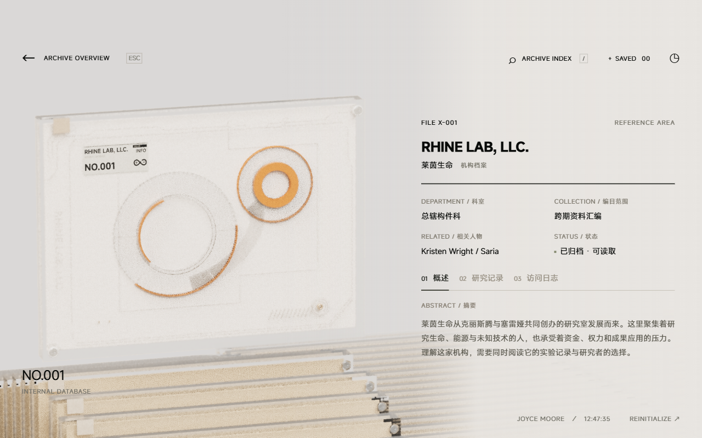
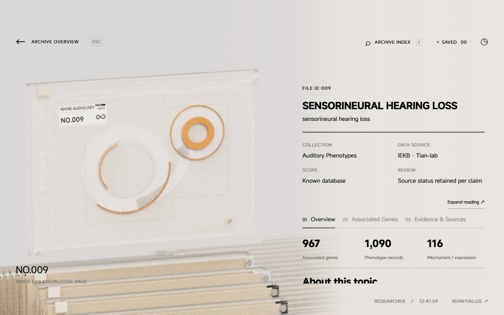

# 上游同步 · 2026-09-09

将 [LBEILC/RhineLabUI](https://github.com/LBEILC/RhineLabUI) 的更新实际接入 Hanziwww 模板分支，目标为 [`dde61fd`](https://github.com/LBEILC/RhineLabUI/commit/dde61fd)。以正常合并保留原作者提交历史。

## 接入内容

| 上游提交 | 功能 |
| --- | --- |
| `89c7742` | 清晰内构、详情解密时间轴与查看器清晰／磨砂切换 |
| `61e9fc0` | 基于测量的非线性开场轨迹 |
| `f8e0f6f` | 锐利光学折边、立面细肋、连续半透明连接带 |
| `56ca970` | 扫描轨道、六颗卫星点、连续 Logo 绘制与切除 |
| `dde61fd` | 齐平外壳、对角螺丝、盖板后的刻线及从上至下的清晰前沿 |

前两项此前通过保留历史的合并成为祖先，但其实现未进入模板工作树；本次一并补入实际代码。Blender 源文件、共享建模脚本与两份产品 GLB 来自上游，保留其复现路径。

模型重建仍通过 Blender MCP：依次执行 `python scripts/blender-mcp.py art/build_archive.py` 与 `python scripts/blender-mcp.py art/build_assembly.py`。发送器补充 `__file__` 上下文，使上游的相对路径解析在 MCP 文本执行环境中也可用；本次直接采用已提交的上游资产，未重复重建。

## 模板适配

- 保留 SiteConfig 品牌、姓名、公司名称、Logo 覆盖与模型动态标签。RHINE AUDIOLOGY 开场和阅读界面继续使用英文。
- 保留固定 288 位置的交互实例池、可变栏目和不等长档案、稳定 ID、切列记忆、纯竖直抽取及先转正后下降。参考时间轴仍使用原始 160 位置。
- 解密完成后再恢复静止光追。复用的快照材质同步清晰度对应的物理粗糙度、厚度和透射；归位副本独立保存清晰度，快速重新选中保留运动状态。
- 新内构在实时渲染中使用上游透明混合捕获，在 GPU 中使用独立的真实透射材质。两处光追采用 16 次常规反弹和 32 次透射穿越；较低预算会将路径截断在多层玻璃内部，产生黑色环面。
- 修正降噪器的预乘透明度顺序，消除光追淡入时短暂叠加过曝。灯光颜色、强度、环境和曝光参数沿用本站暖白配置。
- 主相机保留动态深度范围，近裁剪面下限为 5；参考相机为 near=5 / far=300。详情页已移除的查看器入口继续隐藏，验证脚本通过临时按钮调用保留动作。
- 原站 40 份档案、IEKB 数据快照、两站内容配置和数据许可文件无改动；未更改 Cloudflare 配置或执行线上部署。

## 本分支重新验证

环境：Windows、Node.js 24.18.0、Edge / ANGLE D3D11、NVIDIA GeForce RTX 5090 D v2。

| 检查 | 结果 |
| --- | --- |
| TypeScript；两站生产构建 | 通过；保留现有大 bundle 提示 |
| `npm run check:core` | 11 组通过：导航、循环、运动、外观、装配、UI、光追快照、深度、解密、内构和外壳 |
| `node scripts/check-template.mjs` | 40 份默认正文、栏目顺序、导出一致；1/7/8/9/12/33 份与不等长栏目、Markdown 清理／公式、第三站创建及构建隔离通过 |
| `npm run check:production` | 两站实际 GPU 开始采样；首屏按需加载、独立存储、阅读、基因分页／检索、展开及窄屏通过，无 HTTP 或运行错误 |
| `npm run check:boot` | 两站各九个参考阶段、配置品牌、英文字幕、真实悬停、点击抽取、返回和切档通过 |
| `reference/boot-check.html` | 30 项实测轨迹与真实 DOM 正反跳帧检查通过 |
| `reference/depth-check.html` | 11 个代表镜头中可见档案未被 near=5 截断 |
| `reference/decryption-check.html` | 8 项通过：投影共线、清晰终态、深度、反向材质过渡、拆解中切换、退出与中断 |
| `reference/trace-fade-check.html` | 5 档透明度的 GPU 像素结果符合加权混合，误差不超过 2/255 |
| 两站最终详情截图 | 各 64 samples，1,273,016 个实际三角形，1435 个展开材质实例；解密、退出和快速重新选中通过 |
| 查看器最终 GPU 检查 | 清晰 → 磨砂 → 清晰各 64 samples，退出返回同一清晰档案 |

生产内容与通用开场检查在合并适配后执行；最后的降噪／路径预算调整后重新执行了类型、核心检查、两站构建、模板检查，以及解密和最终 GPU 截图检查。未重新导入 IEKB，也未将构建成功视作视觉验证。

最终截图已人工查看。64 samples 用于检查衔接、材质和构图，仍可见渐进采样噪声，不代表 512 samples 完全收敛或所有硬件上的帧率保证。当前工作副本不含原片；继承的逐帧测量资料与本次运行结果分开记录。

结果：[浏览器报告](upstream/browser-report.json)、[查看器报告](upstream/viewer-trace-report.json)、[核心报告](template/core-report.json)、[模板报告](template/template-report.json)。





## 复现

构建并启动三个本地进程，各自使用独立终端：

```powershell
npm run build
npm run build:audiology
npm run dev
```

```powershell
$env:RHINE_SITE='rhine'
node node_modules/vite/bin/vite.js preview --host 127.0.0.1 --port 5273 --strictPort
```

```powershell
$env:RHINE_SITE='rhine-audiology'
node node_modules/vite/bin/vite.js preview --host 127.0.0.1 --port 5274 --strictPort
```

另一个终端执行 `npm run check:upstream`，会依次运行参考页、两站详情与保留的查看器检查。`npm run check:production` 和 `npm run check:boot` 同样使用 5273 / 5274。检查结束后关闭以上进程。
